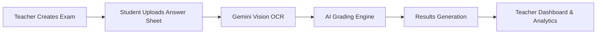

# Waraq — Grade Any Exam in 10 Seconds

> An AI-powered exam grading platform that reads handwritten answer sheets, grades responses, and gives students instant bilingual feedback.


Waraq turns the slowest part of teaching into a fast, intelligent workflow: create an exam key, let students upload answer sheets, and watch scores, feedback, and analytics appear in real time.

## The Problem

Professors spend 6+ hours grading exams manually. Handwritten answers are difficult to process, OCR is unreliable on real paper photos, and students often wait days before receiving feedback.

Waraq focuses on that gap: fast grading, readable feedback, and classroom analytics from messy handwritten submissions.

## The Solution

Waraq is an AI-powered grading platform built around Gemini Vision AI, semantic grading, and an offline fallback architecture.

- Full-page handwritten answer extraction with Gemini Vision
- AI-assisted semantic grading against teacher answer keys
- Instant Arabic and English feedback for students
- Real-time teacher dashboard with analytics and CSV export
- EasyOCR and local text-similarity fallback when AI is disabled or unavailable

## Features

### Student Features

- Upload handwritten exam photos from mobile or desktop
- Submit by exam code
- Receive instant score breakdowns
- View bilingual Arabic/English feedback
- See per-question improvement tips

### Teacher Features

- Create exams with answer keys and max scores
- Manage previously created exams
- Monitor live submissions
- View score distribution charts
- Analyze per-question performance
- Detect the hardest questions
- Search and filter students or exams
- Export dashboard data as CSV
- Auto-refresh dashboard every 30 seconds

## Tech Stack

| Layer | Technology |
| --- | --- |
| Frontend | Next.js 14, React, Tailwind CSS |
| Backend | FastAPI, Python, SQLAlchemy |
| Database | SQLite |
| AI Vision | Gemini Vision `gemini-2.5-flash` |
| OCR Fallback | EasyOCR |
| Charts & Export | Recharts, jsPDF, CSV |
| Local Dev Ports | Frontend `3001`, Backend `8001` |

## System Architecture



## Teacher Dashboard

The dashboard gives teachers a live command center for each exam:

- Live submission monitoring
- Score distribution charts
- Hardest-question detection
- Per-question analytics
- CSV export
- Auto-refresh every 30 seconds
- Student search and filtering

Teachers can also open `/teacher` to view all previously created exams, copy exam codes, and jump directly into each dashboard.

## AI Pipeline

Waraq uses a practical OCR + AI pipeline designed for real exam photos.

1. The uploaded exam image is sent as a full page to Gemini Vision.
2. Gemini extracts question numbers, question text, and student answers as JSON.
3. The grading engine compares extracted answers with the teacher answer key.
4. Gemini provides semantic evaluation and bilingual feedback when enabled.
5. If Gemini is disabled, unavailable, or out of quota, Waraq falls back to EasyOCR and local similarity-based grading.

This keeps the app demo-ready, cost-aware, and resilient.

## Quick Start

### Backend

Use Python 3.11 for best compatibility with OCR dependencies.

```powershell
cd C:\Users\Salwa\Documents\Waraq\backend
.\.venv\Scripts\python.exe -m pip install -r requirements.txt
.\.venv\Scripts\python.exe -m uvicorn main:app --reload --port 8001
```

Backend runs at:

```text
http://localhost:8001
```

### Frontend

```powershell
cd C:\Users\Salwa\Documents\Waraq\frontend
npm install
npm run dev
```

Frontend runs at:

```text
http://localhost:3001
```

## Environment Variables

Create a `.env` file from `.env.example`. Never commit real API keys.

```env
USE_GEMINI=false
GEMINI_API_KEY=
DATABASE_URL=sqlite:///./waraq.db
MAX_IMAGE_SIZE_MB=10
CORS_ORIGINS=http://localhost:3001
NEXT_PUBLIC_API_URL=http://localhost:8001
EASYOCR_MODEL_DIR=./.easyocr
```

To enable Gemini-enhanced OCR and grading:

```env
USE_GEMINI=true
GEMINI_API_KEY=your_gemini_api_key_here
```

Offline mode remains fully functional with `USE_GEMINI=false`.

## Screenshots

> Placeholder section for GitHub portfolio images.

- Dashboard preview
- Results preview
- Setup preview

## Why Waraq?

Waraq solves a real educational workflow problem with a focused AI system: OCR, semantic grading, bilingual feedback, and classroom analytics in one product. The offline fallback architecture makes it practical for demos, classrooms, and environments where API access is limited.

It is designed as a scalable foundation for AI-assisted assessment, not just a one-off OCR demo.

## Future Improvements

- Multi-language OCR support
- LMS integration
- AI cheating detection
- Cloud deployment on Vercel and Railway
- Real-time classroom analytics
- Rubric-based grading controls

## Built By

**Salwa Alameer**  
Computer Science Graduate, Jazan University  
AI & Computer Vision

- LinkedIn: `https://www.linkedin.com/in/salwa-al-ameer`
- GitHub: `https://github.com/SalwaAlamer`
